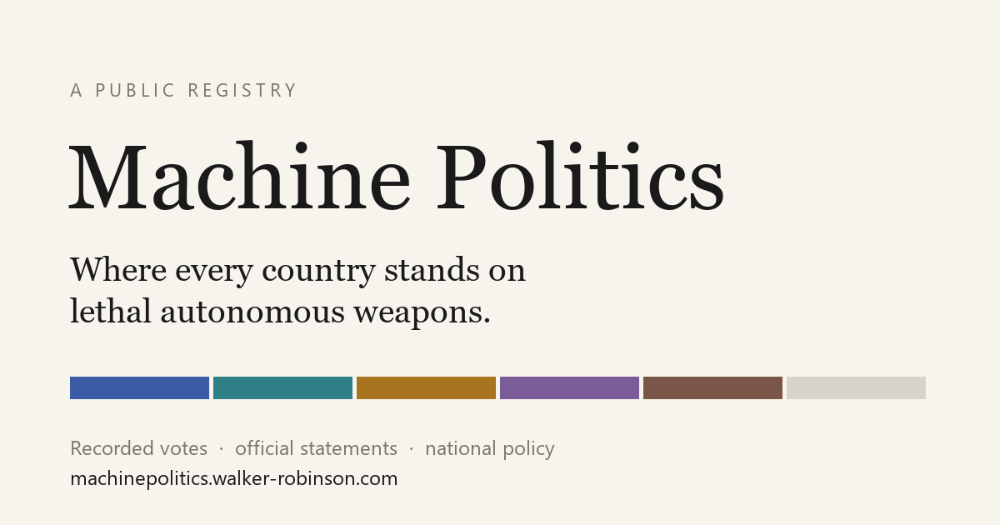

# Machine Politics

[](https://github.com/wrobinson127/machine-politics/actions/workflows/ci.yml)

Where every country stands on lethal autonomous weapons systems: recorded votes, official statements, and national policy, tracked as they shift over time.

**Live: [machinepolitics.walker-robinson.com](https://machinepolitics.walker-robinson.com)**

Machine Politics is researched and written by [Walker Robinson](https://walker-robinson.com), who works on AI policy and national security, including autonomous weapons. Every judgment call is his own.



Positions are trajectories, not snapshots. This repository builds a static site whose home page is a trajectory board: 193 states as rows, time as the axis, position bands with visible breaks where states moved. Every coding traces to a quoted, dated, linked primary source. The site takes no position on whether autonomous weapons should be banned or regulated. It records who says what.

## How it fits together

```
.scratch/source/          official UN voting dataset (manual download only, never committed)
tools/votes_extract.py    -> data/source/ga_voting_extract.csv.gz  (579 rows + provenance header)
                          -> data/derived/votes.json.gz            (per-state trajectories, ISO alpha-3)
content/                  the claim-bearing layer: rubric, per-state codings, source registry, page prose
tools/validate_content.py enforces the evidence schema, the approval gate, and the prohibited-claim class
tools/build_site.py       -> site/  (static, deterministic, hard-excludes unapproved content)
```

The analyst of record approves every coded position, shift event, doctrine claim, and analyst sentence before it renders. Tooling drafts and checks; it does not decide. The deploy build refuses to ship unapproved content, and CI asserts the committed site is byte-identical to a fresh rebuild.

## What is engineered here

- **An approval gate, not a review step.** Every coded position, shift, doctrine claim and analyst sentence carries `approved: true` or it does not render. The deploy build refuses to ship otherwise, and the gate is tested by forcing it open and confirming eight tests fail.
- **A freshness gate.** `site/` is a committed artifact. CI rebuilds it from source and fails on a single differing byte, so the published site can never drift from the content files that justify it.
- **Evidence rules in code.** The validator rejects any coding whose only evidence is an endorsement, a sponsorship or a policy document, enforces verbatim quotes, and refuses an entire class of claim the methodology forbids.
- **Readable without colour vision.** Six of the position hues collide under simulated colour-vision deficiency, and a palette search proved no repalette fixes it, so every category carries a texture as well as a hue. The guarantee is a test, not a design note.
- **Nothing silently absent.** Content-hashed asset URLs, pinned subresource-integrity hashes checked against the CDN, and a build that warns when a record would render nothing: each exists because an earlier version shipped with every gate green and a feature quietly missing.

As of September 2026: all 193 member states' votes on the three resolutions, 33 states with a coded position, and the national-policy record reviewed for all seven major powers on the coverage list.

## Commands

```
pip install -r requirements.txt
python -m pytest tools/tests -q        # full test suite
python tools/validate_content.py       # content schema + claim rules
python tools/votes_extract.py          # rebuild extract + derived votes (needs the source CSV)
python tools/build_site.py             # build the deploy site into site/
python tools/build_site.py --preview   # draft preview with DRAFT banner, .scratch/preview/, localhost only
```

## Data and licensing

Three regimes, split on purpose:

- **UN-derived vote extracts** (`data/`, plus the test fixture): © United Nations, non-commercial with attribution, per the [UN Digital Library terms](https://digitallibrary.un.org/pages/?ln=en&page=tos). The raw dataset is never committed and never fetched by tooling.
- **Project-coded data** (`content/`): CC BY 4.0.
- **Code**: MIT.

Composite files follow the stricter terms. Details in [DATA_LICENSE.md](DATA_LICENSE.md).

## Verification

Verification is enforced in code rather than recorded in a report. `tools/votes_extract.py` refuses to write output unless every resolution reconciles: 193 rows, no duplicate states, and tallies that match both the expected plenary results and the totals embedded in the dataset itself. The test suite holds the approval gate, the freshness gate, the colour-vision guarantee, and the source-pinning checks. The approval, colour-vision, asset-version and source-pinning guards are mutation-tested: each was deliberately broken and the suite confirmed to catch it, so a guard that stopped working could not pass as one that works. The methodology is in [docs/METHODOLOGY.md](docs/METHODOLOGY.md).
